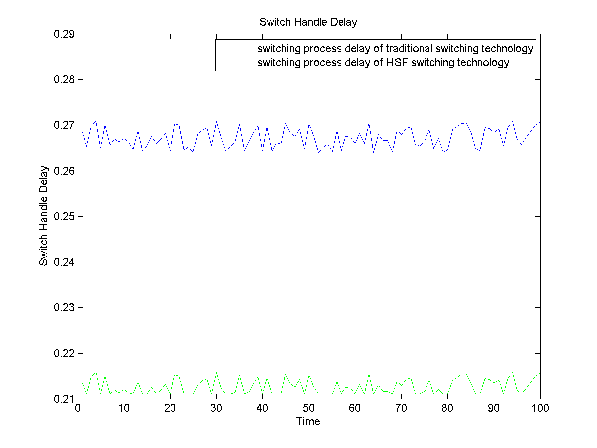
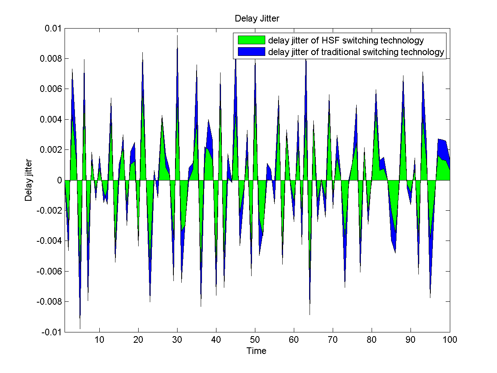

# A Improved Virtual Circuit Switching Technology Based on Concurrent Processing Mode

Virtual circuit switch is composed of five parts:
* Input Buffer Queue
* Table Lookup Module
* Dispatcher
* Fabric
* Output Buffer Queue

* * *
The delays of above five steps include five parts:
* TLD - Table Lookup Delay
* WSD - Wait for Service Delay
* DD - Dispatch Delay
* FTD - Fabric Transfer Delay
* OD - Output Delay

* * *
As presented in the paper, the value of Table Lookup Delay(TLD) is sampled from a random distribution. The values of Wait for Service Delay (WSD), Dispatch Delay (DD),  Fabric Transfer Delay (FTD) and Output Delay (OD) are assumed to be constants. The following equations are used to calculate the Switch Handle Delay and Delay Jitter of traditional virtual circuit switching technology and that of Half Step Forward Switching Technology (HSFST).

* * *
## Switch Handle Delay of traditional virtual circuit network

Switch Handle Delay of traditional virtual circuit network is calculated as follows:

__SHD = TLD + WSD + DD + FTD + OD__

* * *
## Switch Handle Delay of Half Step Forward Switching Technology (HSFST)

Switch Handle Delay of Half Step Forward Switching Technology is calculated as follows:

__SHD = WSD + DD + max(FTD, TLD) + OD__

* * *
## Delay Jitter of traditional virtual circuit network

Delay Jitter of traditional virtual circuit network is calculated as follows:

__&#916;(SHD) = &#916;(TLD + WSD + DD + FTD + OD)__

* * *
## Delay Jitter of Half Step Forward Switching Technology (HSFST)

Delay Jitter of Half Step Forward Switching Technology (HSFST) is calculated as follows:

__&#916;(HFS-SHD) = &#916;(|TLD-FTD| + WSD + DD + OD)__

* * *
The results of simulation of Switch Handle Delay and Delay Jitter of traditional virtual circuit switching technology and that of Half Step Forward Switching Technology (HSFST) are shown as graphs below.

### Simulation Results

##### Simulation results of Switch Handle Delay

##### Simulation results of Delay Jitter

