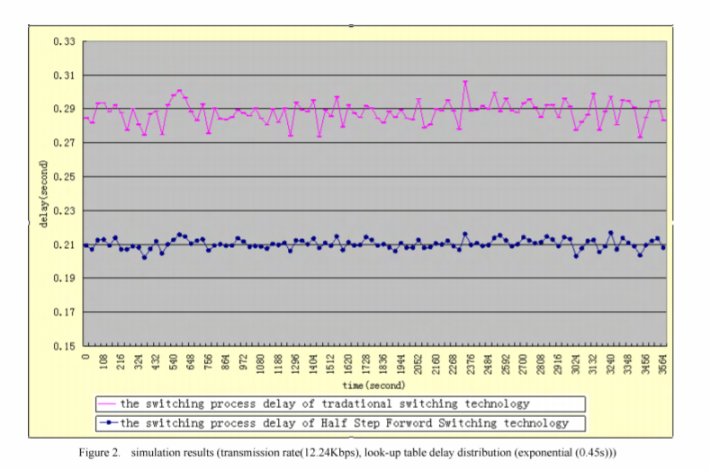
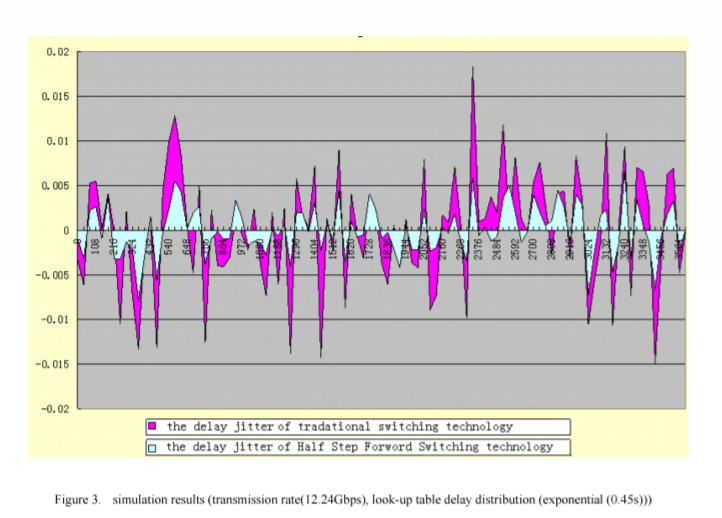

# A Improved Virtual Circuit Switching Technology Based on Concurrent Processing Mode

### Introduction

There is high-speed access technology today and medium technology is undergoing rapid development. The key factor which restricts the development of modern high-speed networks is not the transmission rate of communication circuitry, but the exchange capacity of multi-port router/switch.

Communication of virtual circuit network include three processes:
* Establish connection process
* Data transmission process
* Release connection process

Virtual circuit switch is composed of five parts:
* Input Buffer Queue
* Table Lookup Module
* Dispatcher
* Fabric
* Output Buffer Queue

The traditional virtual circuit switching technology needs five steps to complete above three processes of each communication by the means of serial processing:
* When input port receives the data frame, according to the input Virtual Circuit Identifier (VCI) and output port, Table
Lookup Module acquired correct output VCI and output port number through look-up operation and replaced the primary input VCI with the output VCI.
* The data frame has been saved in corresponding Input Buffer Queue to wait for the next operation.
* Dispatcher selects the appropriate data frame and algorithm to establish the mapping between input port and output port.
* According to the mapping, Fabric closed the corresponding cross-connect nodes and transmitted corresponding data frame to appropriate output port.
* If output port has Output Buffer Queue, The data frame is sent to communication link in accordance with the principle of Fist In Fist Out (FIFO), or sent to the communication link directly.

The delays of above five steps include five parts:
* Table Lookup Delay (TLD)
* Wait for Service Delay (WSD)
* Dispatch Delay (DD)
* Fabric Transfer Delay (FTD)
* Output Delay (OD)

The total Switch Handle Delay(marked SHD) and the delay jitter (marked &#916;(SHD)) can be calculated as followings:

SHD = TLD + WSD + DD + FTD +OD

&#916;(SHD) = &#916;(TLD+WSD+DD+FTD+OD)

Through optimizing the switching procession, a improved virtual circuit switching technology based on concurrent processing mode called Half Step Forward Switching Technology (HSFST) is presented in this paper. The experimental results show that this technique diminishes the switching delay and smoothens the delay jitter. 

The total Switch Handle Delay(marked HFS-SHD) and the delay jitter (marked &#916;(HFS-SHD)) using the  Half Step Forward Switching Technology (HSFST) can be calculated as follows.

HFS-SHD = WSD + DD + Max(TLD,FTD) + OD

&#916;(HFS-SHD) = &#916;(|TLD-FTD|+WSD+DD+OD)

### Figures

##### Simulation results of Switch Handle Delay

##### Simulation results of Delay Jitter

