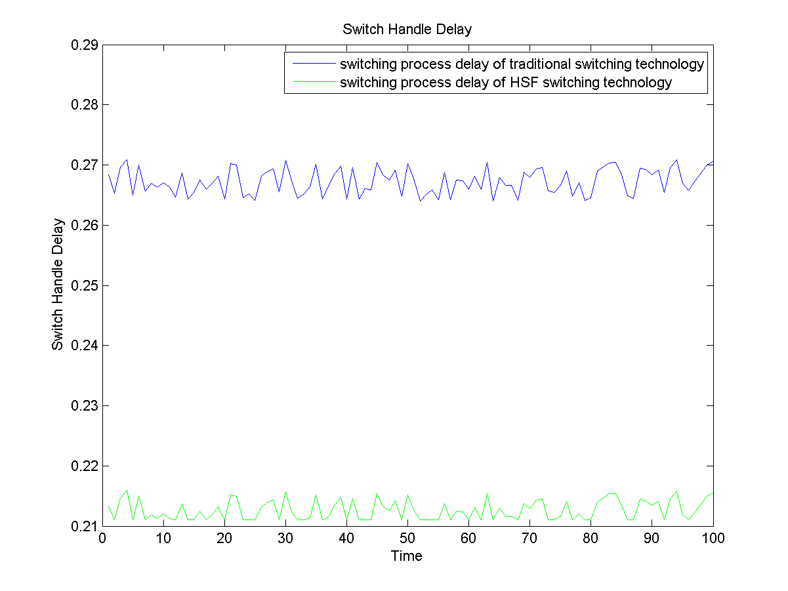
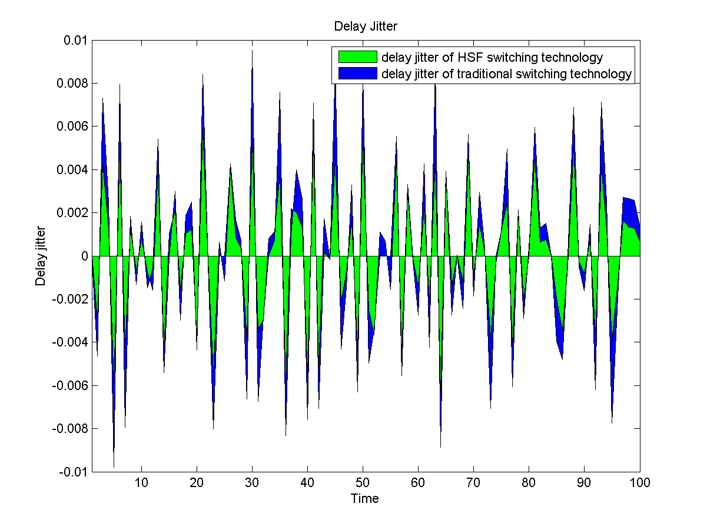

# Data Communications (CO250): Mini-Project

### Title:

An Improved Virtual Circuit Switching Technology Based on Concurrent Processing Mode

### Members:
* Praveen Kumar Gupta (16CO235)   pvgupta24@gmail.com
*  Shashank P (16CO247)           shashankp5424@gmail.com

### Abstract:

The key factor which restricts the development of modern high-speed networks is not the transmission rate of communication circuitry, but the exchange capacity of multi-port router/switch. The paper presents a new method of improved concurrent processing strategy, called Half Step Forward Switching Technology (HSFST) to improve the quality of switches for network service. 

In HSFST, information about next output ports are encapsulated in frames at the former switches, thus allowing the received data frame to directly switch to proper output ports without looking up for the information in switch table. So the operation of looking up for the information about next hop and the other operation can be processed simultaneously.

### Objectives:

* Compare switching process delay between traditional switching technique and HSFST algorithm
* Compare delay jitter between traditional switching technique and HSFST algorithm

### References:

A improved virtual circuit switching technology based on concurrent processing mode : 

http://ieeexplore.ieee.org/document/6023561/

## File Structure

| Modules        	    | Description 
| ------------- 	    |------------- 
| Introduction.md	    | Explains theoretical aspects of the mini project 
| Design.md      	    | Explains design aspects of the mini project  
| main.m  			    | Main module     
| getTLD.m              | Module to find the Table Lookup Delay(TLD)
| getWSD.m              | Module to find the Wait for Service Delay(WSD)
| getDD.m               | Module to find the Dispatch Delay(DD)
| getFTD.m              | Module to find the Fabric Transfer Delay(FTD)
| getOD.m               | Module to find the Output Delay(OD)
| calculateSHD.m        | Module to calculate Switch Handle Delay (SHD)
| calculateHFS_SHD.m    | Module to calculate Switch Handle Delay of Half Step Forward Switching Technology (HSFST)
| calculateDelSHD.m     | Module to calculate Delay Jitter of traditional virtual circuit switching technology
| calculateDelHFS_SHD.m | Module to calculate Delay Jitter of Half Step Forward Switching Technology (HSFST)

#### Expected Results

##### Expected Simulation results (transmission rate( 12.24Kbps), look-up table delay distribution (exponential (0.45s)))

##### Expected Simulation results (transmission rate( 12.24Kbps), look-up table delay jitter distribution (exponential (0.45s)))

### Simulation Results

##### Simulation results (transmission rate( 12.24Kbps), look-up table delay distribution (exponential (0.45s)))

##### Simulation results (transmission rate( 12.24Kbps), look-up table delay jitter distribution (exponential (0.45s)))
